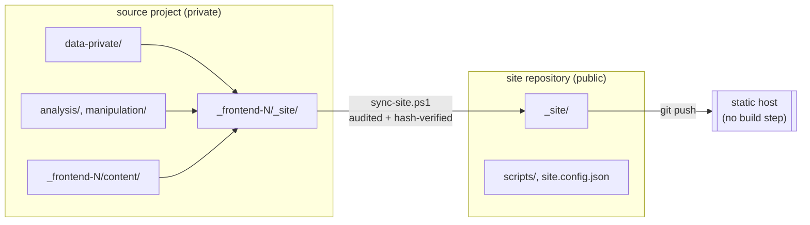

# Publishing model

Design notes for repositories created from `RG-FIDES/publish-site-template`.

## The problem

A reproducible research project mixes things that must stay private (raw microdata,
derived databases, credentials) with things that should be public (a rendered narrative
website). Publishing directly from the project repository means the public deployment is
one misconfigured `.gitignore` away from a disclosure incident, and every deployment
depends on a build environment that can reconstruct private inputs.

## The split

Two repositories, one direction of flow.

Invariants:

1. **Rendering happens only in the source project.** The site repository has no build
   step, no renderer, and no access to private inputs. It cannot accidentally reveal
   something it never had.
2. **Transfer is the only ingress.** No content is authored in the site repository.
   Every published byte came through `scripts/sync-site.ps1`.
3. **Parity is verifiable.** The transfer compares SHA-256 hashes of every file before
   and after. A published site that does not match its source render fails loudly.
4. **The host does no work.** It serves committed files. Deployment cannot fail for
   environment reasons, and what you reviewed locally is what goes live.

## Why not a build on the host

Hosting platforms can render Quarto or similar sites in CI. That would require putting
private data, or credentials to reach it, into the deployment environment. It also makes
the published output non-deterministic with respect to the reviewed diff. Committing the
artifact trades repository size for auditability, which is the correct trade for research
publication.

## Why not a submodule or subtree

Both couple the public repository's history to the private one. A file-level transfer with
an explicit allow/deny policy is easier to reason about, easier to audit in review, and
degrades safely: the worst failure mode is a stale site, not a leak.

## Initialization

`scripts/initialize-site.ps1` binds the repository to exactly one frontend:

1. Resolves the frontend and its generated site directory.
2. Walks up to the source project's git root and reads its `origin` remote.
3. Audits the generated site against the publish policy.
4. Detects the landing page by following a meta-refresh stub at the entry point — Quarto
   writes `index.html` as a redirect into a nested `content/index.html`, and hosts need to
   know the real first page.
5. Writes `site.config.json`, renders `templates/` into `README.md` and `netlify.toml`,
   and performs the first transfer.

`source.localPath` is the only machine-specific value. On a different machine, update it
or pass `-Source` explicitly.

## Publishing a second frontend

One repository publishes one frontend. A project with two frontends intended for separate
audiences gets two site repositories, each created from this template. Re-running
`initialize-site.ps1` against a different frontend repoints an existing repository, which
is appropriate when a frontend is superseded (`_frontend-1` → `_frontend-2`), not when both
should remain live.

## Failure modes and responses

| Symptom | Cause | Response |
| --- | --- | --- |
| Transfer reports zero changes | Frontend was not re-rendered | Re-render in the source project |
| Transfer refuses: forbidden file type | Renderer copied source or data into the output | Fix the frontend's render configuration; do not relax the policy |
| Transfer warns: sensitive pattern found | A private path leaked into generated HTML | Inspect the source page; usually a hard-coded local path in a code echo |
| Post-transfer verification fails | Destination changed during the run, or a file was hand-edited | Re-run the transfer; never edit generated files |
| Site root 404s | Entry point or landing page misdetected | Check `publish.entryPoint` and `publish.landingPage` in `site.config.json` |
| Many unexpected asset changes | Renderer or theme version changed in the source project | Expected; confirm the version bump was intentional |
